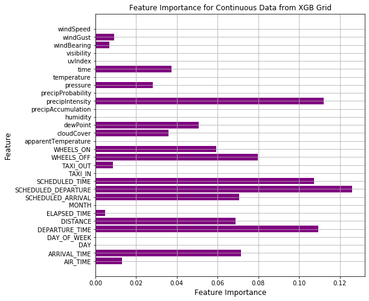
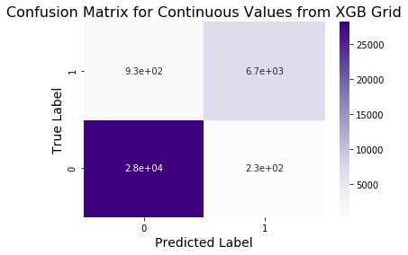
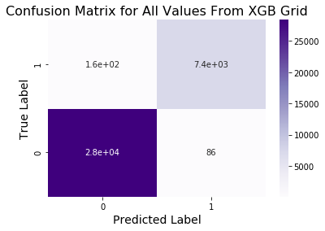

# Module 3 (V2.1) - Final Project

## Building a Classification Model

## Objectives

Create classification models using both Random Forest Classifier and XGBoost, with and without gridsearch hyperparameters, to predict whether or not a flight will be delayed. The dataset chosen to create the classifier is '2015 Flight Delays and Cancellations', from kaggle.com. This dataset was published by the U.S. Department of Transportation's (DOT) Bureau of Transportation Statistics and contains flight data for 14 major airlines during 2015.

[2015 Flight Delays and Cancellations](https://www.kaggle.com/usdot/flight-delays#flights.csv)

    

## Method

Downsize the dataset from ~5.8 million entries to ~150K entries by filtering to values with an origin airport of IAH, George Bush International Airport in Houston, Texas. 

Make an API call to Dark Sky API for weather data from IAH for every hour of 2015. Join this weather dataframe to the IAH flights dataframe on the appropriate hour datetime columns. 

Seperate the data into two categories: continuous variables, and categorical variables, and run the following models:

* Random forest model with default hyperparameters
    * With only continuous variables
    * With continuous and categorical variables

* XGBoost model with default hyperparameters
    * With only continuous variables
    * With continuous and categorical variables

* XGBoost with Grid Search hyperparameters (optimized on a 10K values subset)
    * With only continuous variables
    * With continuous and categorical variables
 
    
## Findings

The XGBoost with gridsearch outperformed the XGBoost with default parameters on the continuous values dataset, as well as on the continuous and categorical dataset, according to the F1 score. 

## Table of Contents

[Jupyter_Notebook](Module3V2.1FinalProject.ipynb)

[Summary_Slides](Module3V2.1SummarySlides.pdf)

[Blog_Post](https://medium.com/@stacyshingleton/predicting-flight-delays-3caeecf3982d)

